```json
{
  "date": "2022.12.18 21:30",
  "title": "正则表达式",
  "tag":"其他"
}
```

## 1. 元字符

### 特殊单字符

`.` 表示换行以外的任意单个字符

`\d` 表示任意单个数组   `\D` 表示任意非数字

`\w` 表示任意单个数字或字母或下划线  `\W` 任意非数字或字母或下划线

`\s` 表示任意空白符  `\S` 任意非空白符

### 空白符

`\r` 回车符 `\n` 换行符  `\f` 换页符  `\t` 制表符 `\v` 垂直制表符 `\s` 任意空白符


在正则中，空格就是用普通的字符英文的空格来表示

### 量词

在正则中，英文的星号（*）代表出现 0 到多次，加号（+）代表 1 到多次，问号（?）代表 0 到 1 次，{m,n}代表 m 到 n 次。

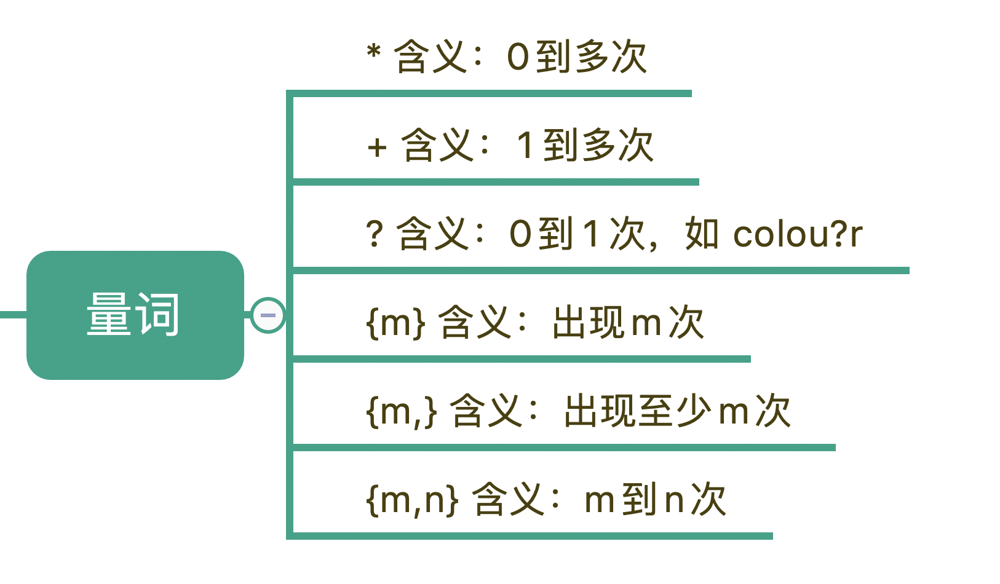

### 范围

在正则表达式中，表示范围的符号有四个分类，如下图所示：

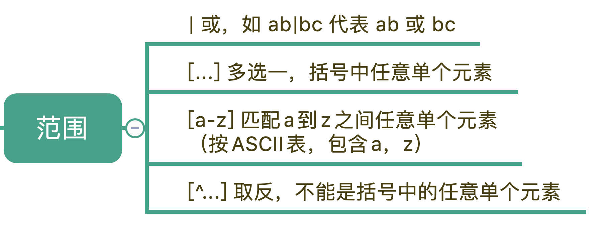

首先是管道符号，我们用它来隔开多个正则，表示满足其中任意一个就行，比如 ab|bc 能匹配上 ab，也能匹配上 bc，在正则有多种情况时，这个非常有用。

中括号[]代表多选一，可以表示里面的任意单个字符，所以任意元音字母可以用 [aeiou] 来表示。另外，中括号中，我们还可以用中划线表示范围，比如 [a-z] 可以表示所有小写字母。如果中括号第一个是脱字符（^），那么就表示非，表达的是不能是里面的任何单个元素

## 2. 量词与贪婪

在这 量词的元字符中，我们可以用 {m,n} 来表示 （*）（+）（?） 这 3 种元字符：

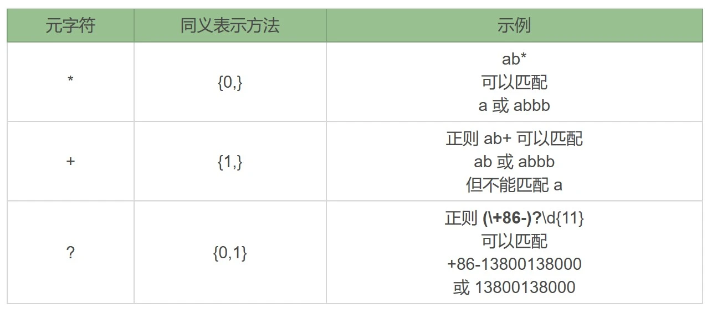

使用 a+ 在 aaabb 中查找，只有一个输出结果，再使用 a* 在 aaabb 这个字符串中进行查找，可以找到 4 个匹配结果。因为这一次的结果匹配到了三次空字符串，星号（*）代表 0 到多次，匹配 0 次就是空字符串。

### 贪婪模式

贪婪模式，简单说就是尽可能进行最长匹配。非贪婪模式呢，则会尽可能进行最短匹配。正是这两种模式产生了不同的匹配结果。

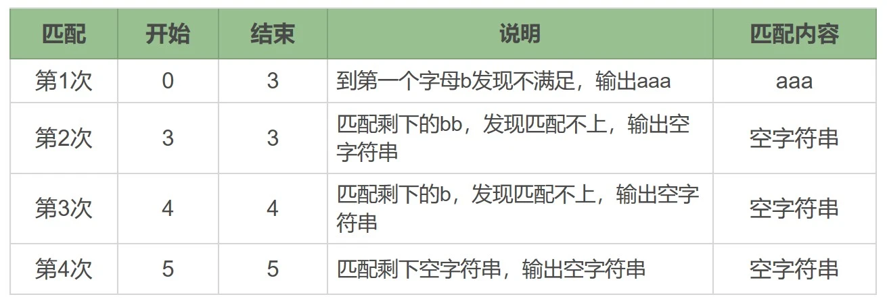

a* 在匹配开头的 a 时，会尝试尽量匹配更多的 a，直到第一个字母 b 不满足要求为止，匹配上三个 a，后面每次匹配时都得到了空字符串。

贪婪模式的特点就是尽可能进行最大长度匹配，如果我们想尽可能最短匹配呢？那就要用到非贪婪匹配模式了。

### 非贪婪模式

正则中量词默认是贪婪匹配，如果想要进行非贪婪匹配需要在量词后面加上问号，正则就变成了 a*?

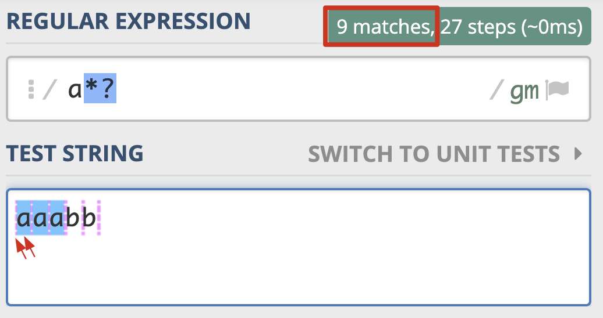

这次匹配到的结果都是单个的 a，就连每个 a 左边的空字符串也匹配上了。

## 3. 分组与引用

括号在正则中的功能就是用于分组。简单来理解就是，由多个元字符组成某个部分，应该被看成一个整体的时候，可以用括号括起来表示一个整体，这是括号的一个重要功能，另外一个作用，那就是“复用”。

### 分组与编号

括号在正则中可以用于分组，被括号括起来的部分“子表达式”会被保存成一个子组。

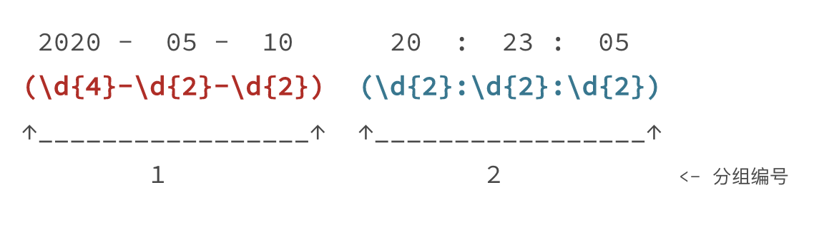

这里有个时间格式 2020-05-10 20:23:05。假设我们想要使用正则提取出里面的日期和时间。

我们可以写出如图所示的正则，将日期和时间都括号括起来。这个正则中一共有两个分组，日期是第 1 个，时间是第 2 个。

### 不保存分组

在括号里面的会保存成子组，如果只想用括号将某些部分看成一个整体，后续不用再用它，没必要保存子组的，我们可以在括号里面使用 ?: 不保存子组。

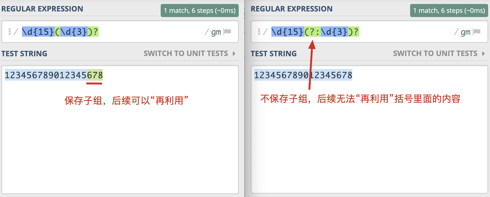

### 括号嵌套

在括号嵌套的情况里，只需要数左括号（开括号）是第几个，就可以确定是第几个子组。

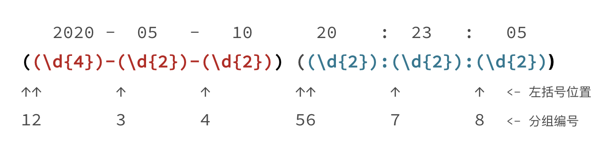

日期分组编号是 1，时间分组编号是 5，年月日对应的分组编号分别是 2，3，4，时分秒的分组编号分别是 6，7，8。

### 分组引用

大部分情况下，我们就可以使用 “反斜扛 + 编号”，即 \number 的方式来进行引用，不同语言不同规则，Go语言官方包暂不支持

在查找中使用可以，比如我们要找重复出现的单词，我们使用正则可以很方便地使“前面出现的单词再次出现”，具体要怎么操作呢？我们可以使用 \w+ 来表示一个单词，针对刚刚的问题，我们就可以很容易写出 (\w+) \1 这个正则表达式了。

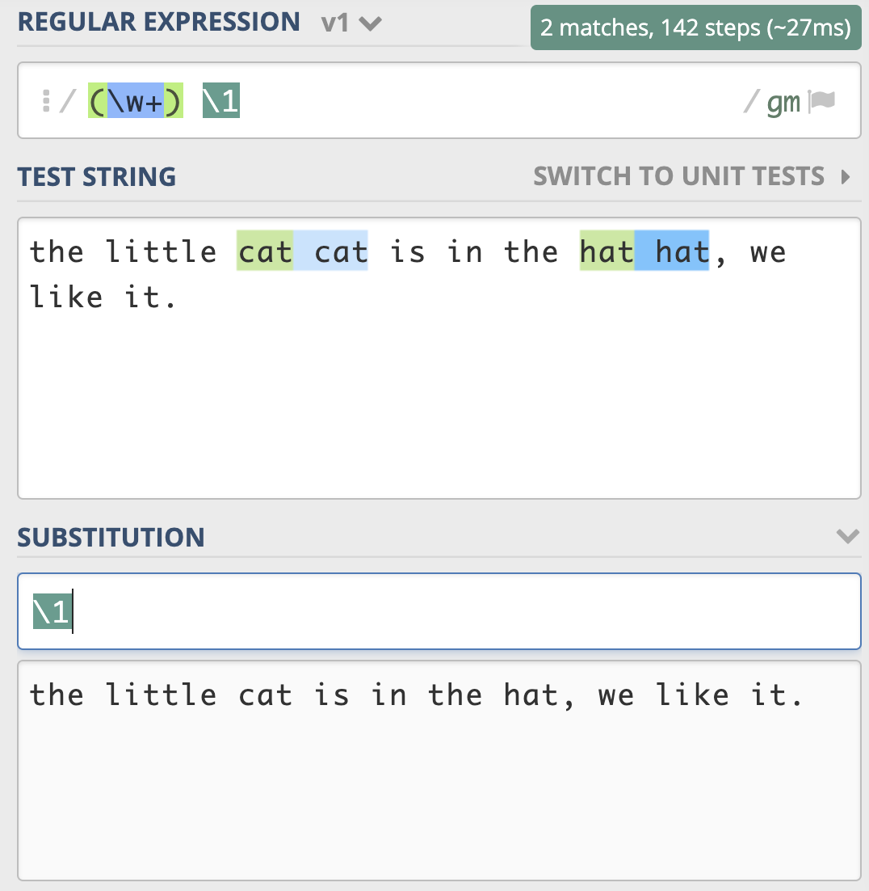

在替换中使用，可以使用反向引用，在得到的结果中，去拼出来我们想要的结果。还是使用刚刚日期时间的例子，我们可以很方便地将它替换成， 2020 年 05 月 10 日这样的格式。

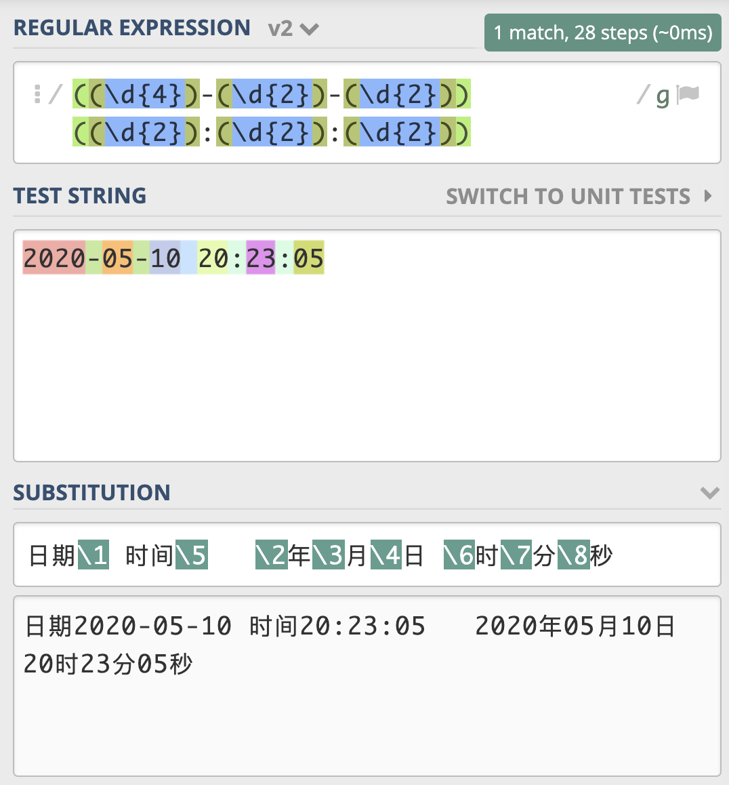

## 4. 匹配模式

所谓匹配模式，指的是正则中一些改变元字符匹配行为的方式，比如匹配时不区分英文字母大小写。常见的匹配模式有 4 种，分别是不区分大小写模式、点号通配模式、多行模式和注释模式。

### 不区分大小写模式（Case-Insensitive）

模式修饰符是通过 (? 模式标识) 放在整个正则前面的方式来表示的。由于不分大小写的英文是 Case-Insensitive，那么对应的模式标识就是 I 的小写字母 i，所以不区分大小写的 cat 就可以写成 (?i)cat。

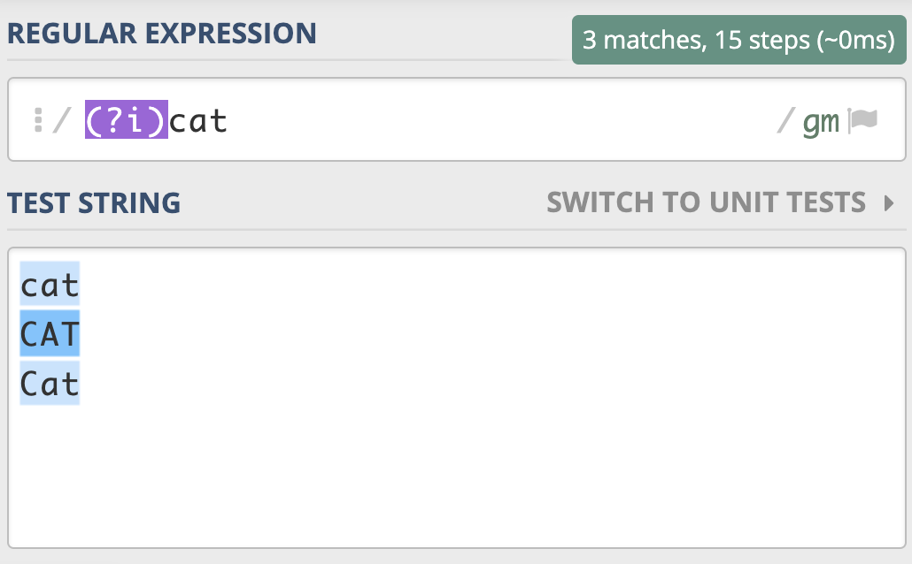

不区分大小写模式的要点：

1. 不区分大小写模式的指定方式，使用模式修饰符 (?i)；
2. 修饰符如果在括号内，作用范围是这个括号内的正则，而不是整个正则；
3. 使用编程语言时可以使用预定义好的常量来指定匹配模式。

### 多行匹配模式（Multiline）

^匹配整个字符串的开头，$ 匹配整个字符串的结尾。

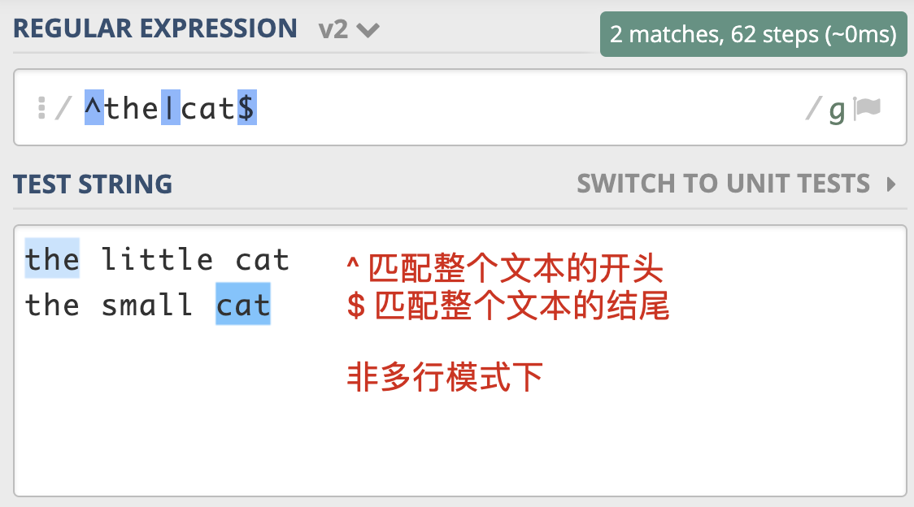

多行模式的作用在于，使 ^ 和 $ 能匹配上每行的开头或结尾，我们可以使用模式修饰符号 (?m) 来指定这个模式。

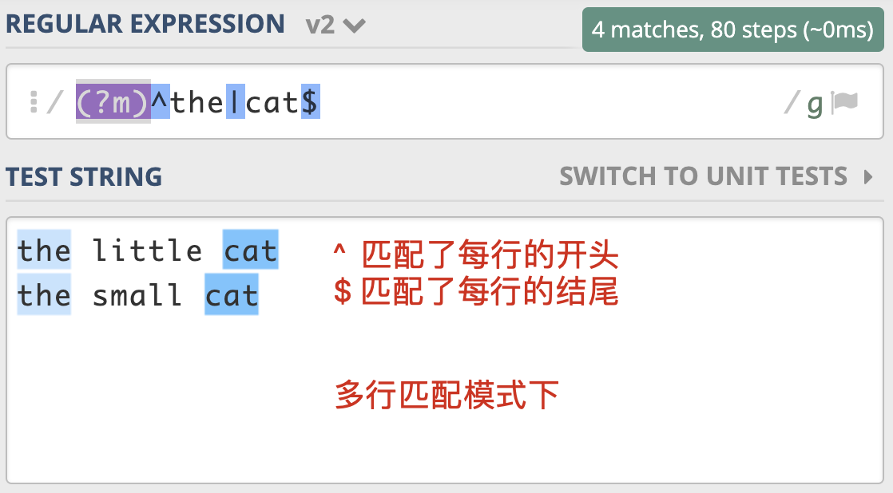

值得一提的是，正则中还有 \A 和 \z（Python 中是 \Z） 这两个元字符容易混淆，\A 仅匹配整个字符串的开始，\z 仅匹配整个字符串的结束，在多行匹配模式下，它们的匹配行为不会改变，如果只想匹配整个字符串，而不是匹配每一行，用这个更严谨一些。

### 注释模式

注释模式则可以在正则中添加注释，让正则变得更容易阅读和维护。正则中注释模式是使用 (?#comment) 来表示。

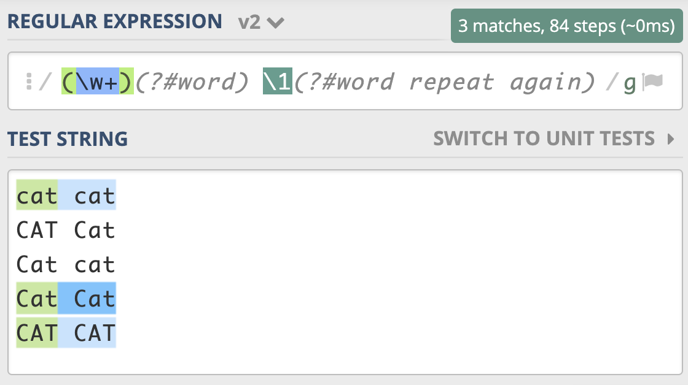

## 5. 断言

在有些情况下，我们对要匹配的文本的位置也有一定的要求。为了解决这个问题，正则中提供了一些结构，只用于匹配位置，而不是文本内容本身，这种结构就是断言。常见的断言有三种：单词边界、行的开始或结束以及环视。

### 单词边界（Word Boundary）

在正则中使用\b 来表示单词的边界。\b 中的 b 可以理解为是边界（Boundary）这个单词的首字母。

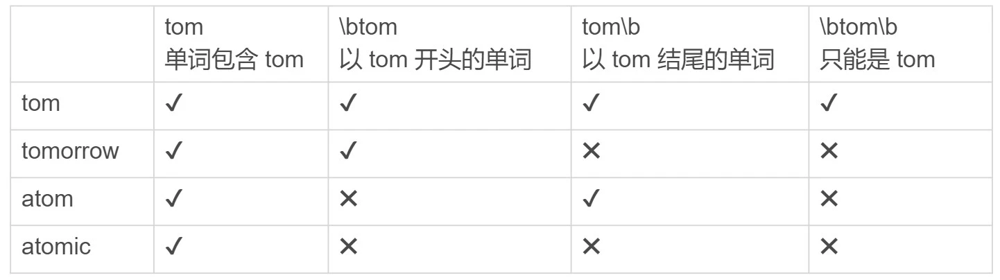

### 行的开始或结束

和单词的边界类似，在正则中还有文本每行的开始和结束，如果我们要求匹配的内容要出现在一行文本开头或结尾，就可以使用 ^ 和 $ 来进行位置界定。

### 环视（ Look Around）

环视就是要求匹配部分的前面或后面要满足（或不满足）某种规则，有些地方也称环视为零宽断言。

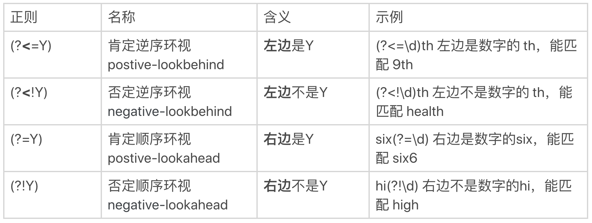

环视中虽然也有括号，但不会保存成子组。保存成子组的一般是匹配到的文本内容，后续用于替换等操作，而环视是表示对文本左右环境的要求，即环视只匹配位置，不匹配文本内容。

## 6. 转义

在正则中正确表示“反斜杠”具体的过程是这样子：我们输入的字符串，四个反斜杠 \\，经过第一步字符串转义，它代表的含义是两个反斜杠 \；这两个反斜杠再经过第二步正则转义，它就可以代表单个反斜杠 \了。

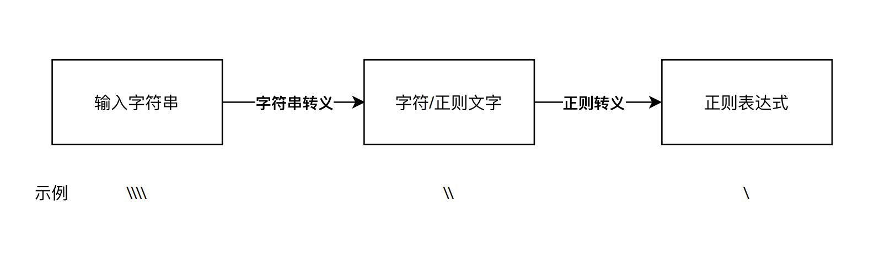

### 元字符的转义

量词 `*` `+` `?` `-` `|` `^` `$` ，直接在前面加反斜杠

括号 `[] {}` 只需转义开括号，都转义也可以，如`\[]\{}`。圆括号 () 两个都要转义

### 字符组中的转义

脱字符在中括号中，且在第一个位置需要转义：

```python
>>> import re
>>> re.findall(r'[^ab]', '^ab')  # 转义前代表"非"
['^']
>>> re.findall(r'[\^ab]', '^ab')  # 转义后代表普通字符
['^', 'a', 'b']
```

中划线在中括号中，且不在首尾位置：

```python
>>> import re
>>> re.findall(r'[a-c]', 'abc-')  # 中划线在中间，代表"范围"
['a', 'b', 'c']
>>> re.findall(r'[a\-c]', 'abc-')  # 中划线在中间，转义后的
['a', 'c', '-']
>>> re.findall(r'[-ac]', 'abc-')  # 在开头，不需要转义
['a', 'c', '-']
>>> re.findall(r'[ac-]', 'abc-')  # 在结尾，不需要转义
['a', 'c', '-']

```

右括号在中括号中，且不在首位：

```python
>>> import re
>>> re.findall(r'[]ab]', ']ab')  # 右括号不转义，在首位
[']', 'a', 'b']
>>> re.findall(r'[a]b]', ']ab')  # 右括号不转义，不在首位
[]  # 匹配不上，因为含义是 a后面跟上b]
>>> re.findall(r'[a\]b]', ']ab')  # 转义后代表普通字符
[']', 'a', 'b']
```

### 字符组中其它的元字符

一般来说如果我们要想将元字符（.*+?() 之类）表示成它字面上本来的意思，是需要对其进行转义的，但如果它们出现在字符组中括号里，可以不转义。这种情况，一般都是单个长度的元字符，比如点号（.）、星号（*）、加号（+）、问号（?）、左右圆括号等。它们都不再具有特殊含义，而是代表字符本身。但如果在中括号中出现 \d 或 \w 等符号时，他们还是元字符本身的含义。

## 7. Unicode

在正则中常用的有三种，分别是按功能划分的 Unicode Categories（有的也叫 Unicode Property），比如标点符号，数字符号；按连续区间划分的 Unicode Blocks，比如只是中日韩字符；按书写系统划分的 Unicode Scripts，比如汉语中文字符。

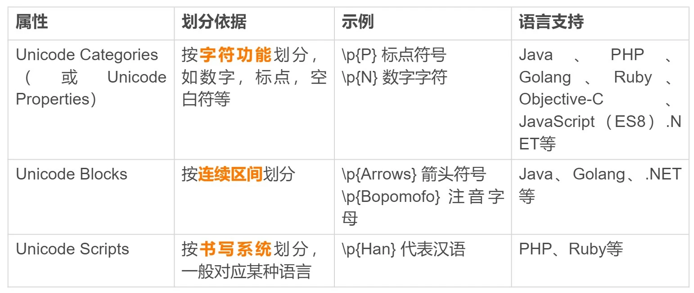