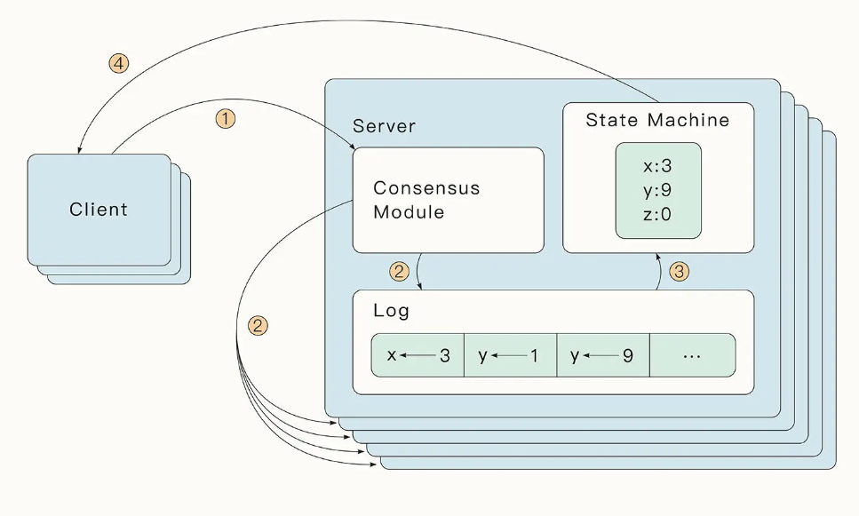
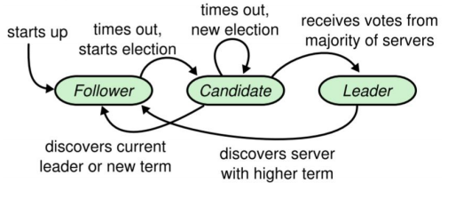
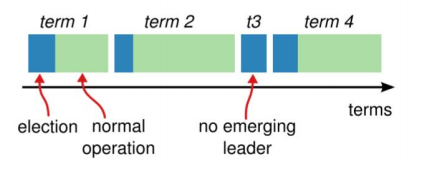
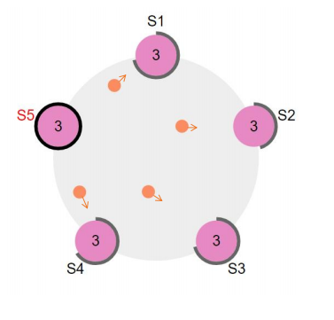
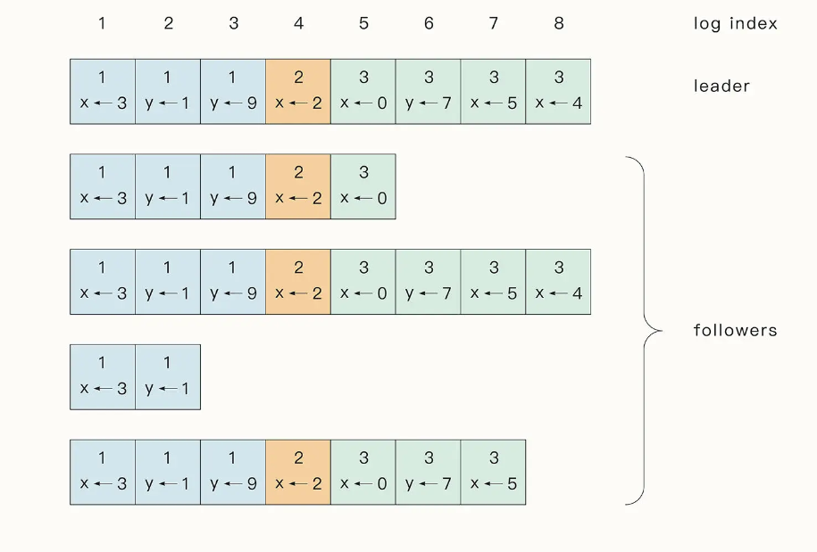
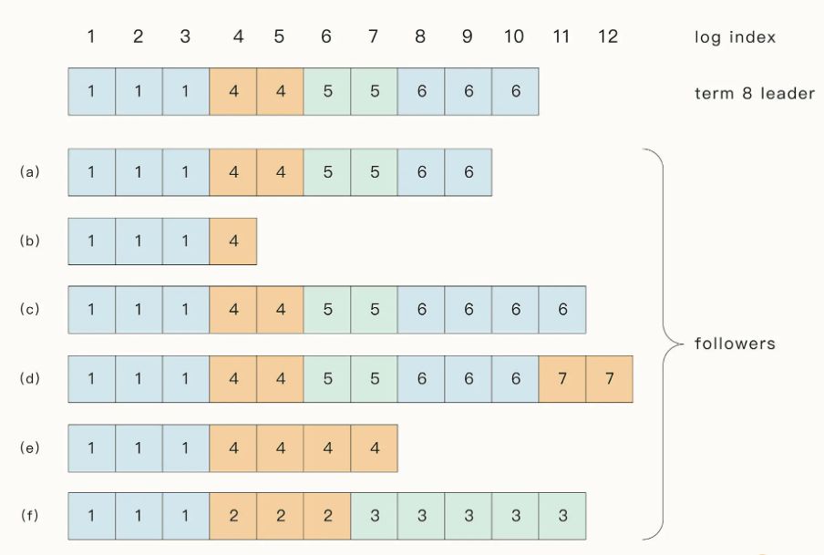
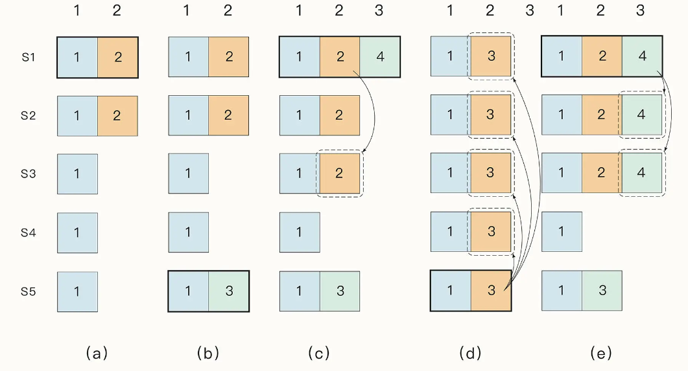

```json
{
  "date": "2022.12.16 16:30",
  "title": "Raft分布式容错共识算法",
  "tag":"分布式"
}
```

## 1.什么是Raft

相比于Paxos，Raft最大的特性就是**易于理解（Understandable）**。为了达到这个目标，

Raft主要做了两方面的事情：

1. **问题分解**：把共识算法分为三个子问题，分别是**领导者选举（leader election）** 、**日志复制（log replication）**、**安全性（safety）**

2. **状态简化**：对算法做出一些限制，减少状态数量和可能产生的变动。

## 2.复制状态机

**相同的初始状态 + 相同的输入 = 相同的结束状态**

多个节点上，从**相同的初始状态**开始，执行一串命令，产生相同的最终状态

Raft算法中实现了一种复制状态机，leader将客户端请求(command) 封装到一个个log entry中，将这些log entry复制到所有follower节点，然后大家按相同顺序应用log entries中的command，根据复制状态机的理论，大家的结束状态肯定是一致的。



可以说，我们使用共识算法，就是为了实现复制状态机。一个分布式场景下的各节点间，就是通过共识算法来保证命令序列的一致，从而始终保持它们的**状态一致**，从而实现高可用的。（投票选主是一种特殊的命令）

## 3. 状态简化

Raft 中的节点有 3 种状态，**领导者（Leader）**，**候选人（Candidate）**和**跟随者（Follower）**。



Raft把时间分割成任意长度的**任期（term）**，任期用连续的整数标记

每一段任期从一次选举开始。在某些情况下，一次选举无法选出leader（比如两个节点收到了相同的票数），在这种情况下，这一任期会以没有leader结束；一个新的任期（包含一次新的选举）会很快重新开始。Raft保证在任意一个任期内，最多只有一个leader



Raft 节点之间通过 **RPC**（Remote Prcedure Cal，远程过程调用）来进行通信。

Raft 论文中指定了两种方法用于节点的通信：

**RequestVote RPC(请求投票)** ：由 Candidate 在选举时使用

**AppendEntries RPC(追加条目)** ：则是 Leader 复制 log 到其他节点时使用，同时也可以用于心跳检测。

服务器之间通信的时候会**交换当前任期号**；如果一个服务器上的当前任期号比其他的小，该服务器会将自己的任期号更新为较大的那个值。

如果一个candidate或者leader发现自己的任期号过期了，它会立即回到follower状态。

如果一个节点接收到一个包含过期的任期号的请求，它会直接拒绝这个请求。

## 4. 领导者选举

Raft内部有一种**心跳机制**，如果存在leader，那么它就会周期性地向所有follower发送心跳，来维持自己的地位。如果follower一段时间没有收到心跳，那么他就会认为系统中没有可用的leader了，然后开始进行选举。



开始一个选举过程后，follower先**增加自己的当前任期号**，并转换到**candidate**状态。然后**投票给自己**，并且并行地向集群中的其他服务器节点发送投票请求（RequestVote RPC）

最终会有三种结果：

•  它获得**超过半数选票**赢得了选举 -> 成为**leader**并开始发送心跳

•  其他节点赢得了选举 -> 收到**新leader的心跳**后，如果**新leader的任期号不小于自己当前的任期号**，那么就从candidate回到follower状态

•   一段时间之后没有任何获胜者 -> 每个candidate都在一个自己的**随机选举超时时间**后增加任期号开始新一轮投票

为什么会没有获胜者？比如有多个follower同时成为candidate，得票太过分散，没有任何一个candidate得票超过半数。论文中给出的随机选举超时时间为 **150~300ms**。

```go
// 请求投票RPC Request
type RequestVoteRequest struct{
    term         int // 自己当前的任期号
    candidated   int // 自己的ID
    lastLogIndex int // 自己最后一个日志号
    lastLogTerm  int // 自己最后一个日志的任期
}
// 请求投票RPC Response
type RequestVoteResponse struct{
    term  int // 自己当前的任期号
    voteGranted bool // 自己会不会投票给这个candidate
}
```

对于没有成为candidate的follower节点，对于同一个任期，会按照**先来先得**的原则投出自己的选票。为什么RequestVote RPC中要有candidate最后一个日志的信息呢，**安全性**子问题中会给出进一步的说明

## 5. 日志复制

Leader被选举出来后，开始为客户端请求提供服务。Leader接收到客户端的指令后，会把指令作为一个新的Entry追加到**日志**中去（日志中包含日志号（日志索引）、leader的任期号、状态机指令）。Leader**并行**发送**AppendEntries RPC**给follower，让它们复制该Entry。当该Entry被**超过半数**的follower复制后，leader就可以在**本地执行该指令**并**把结果返回客户端**。我们把本地执行指令，也就是leader应用日志与状态机这一步，称作**提交（Committed）。**



在此过程中，leader或follower随时都有崩溃或缓慢的可能性，Raft必须要在有宕机的情况下继续支持日志复制，并且保证每个副本日志顺序的一致（以保证复制状态机的实现）。具体有三种可能：

1. 如果有follower因为某些原因**没有给leader响应**，那么leader会不断地**重发**追加条目请求（**AppendEntries RPC**），哪怕leader已经回复了客户端。

2. 如果有**follower崩溃后恢复**，这时Raft追加条目的**一致性检查**生效，保证follower能按顺序恢复崩溃后的缺失的日志。

   Raft的**一致性检查**：leader在每一个发往follower的追加条目RPC中，会放入**前一个日志条目的索引位置和任期号**，如果follower在它的日志中找不到前一个日志，那么它就会拒绝此日志，leader收到follower的拒绝后，会发送前一个日志条目，从而**逐渐向前定位到follower第一个缺失的日志**。

3. Raft在这种情况下，leader通过**强制follower复制它的日志**来解决不一致的问题，这意味着follower中跟leader冲突的日志条目会被新leader的日志条目覆盖（因为没有提交，所以不违背外部一致性）。



通过这种机制，leader在当权之后就**不需要任何特殊的操作**来使日志恢复到一致状态。Leader只需要进行正常的操作，然后日志就能在回复AppendEntries一致性检查失败的时候**自动**趋于一致。

Leader从来不会覆盖或者删除自己的日志条目（Append-Only）

这样的日志复制机制，就可以保证一致性特性：

•  只要过半的服务器能正常运行，Raft就能够接受、复制并应用新的日志条目；在正常情况下，新的日志条目可以在一个RPC来回中被复制给集群中的过半机器；

•  单个运行慢的follower不会影响整体的性能。

```go
// 追加日志RPC Request
type AppendEntriesRequest struct{
    term         int // 自己当前的任期号
    leaderId     int // leader（也就是自己）的ID
    prevLogIndex int // 前一个日志的日志号
    prevLogTerm  int // 前一个日志的任期号
    entries   []byte // 当前日志体
    leaderCommit int // leader的已提交日志号
}
// 请求投票RPC Response
type AppendEntriesResponse struct{
    term  int // 自己当前的任期号
    success bool // 如果follower包括前一个日志，则返回true
}
```

如果leaderCommit > commitIndex，那么把commitIndex设为min(leaderCommit, index of last new entry)

## 6. 安全性

领导者选举和日志复制两个子问题实际上已经涵盖了共识算法的全程，但这两点还不能完全**保证每一个状态机会按照相同的顺序执行相同的命令**。

所以Raft通过几个补充规则完善整个算法，使算法可以在各类宕机问题下都不出错。

1. **Leader宕机处理：选举限制**

   如果一个follower落后了leader若干条日志（但**没有漏一整个任期**），那么下次选举中，按照领导者选举里的规则，它依旧有可能当选leader。它在当选新leader后就永远也无法补上之前缺失的那部分日志，从而造成状态机之间的不一致。

   所以需要对领导者选举增加一个限制，保证被选出来的leader一定包含了之前各任期的所有**被提交的日志条目**。

   **RequestVote RPC**执行了这样的限制：RPC中包含了candidate的日志信息，如果投票者自己的日

   志比candidate的还**新**，它会拒绝掉该投票请求。

   Raft通过比较两份日志中最后一条日志条目的索引值和任期号来定义谁的日志比较新。

   (1)**如果两份日志最后条目的任期号不同，那么任期号大的日志更“新”** 。

   (2)**如果两份日志最后条目的任期号相同，那么日志较长的那个更“新”** 。

   

2. **Leader宕机处理：新leader是否提交之前任期内的日志条目**

   一旦当前任期内的某个日志条目已经存储到**过半**的服务器节点上，leader就知道该日志条目可以被**提交**了。follower的提交触发：下一个AppendEntries RPC：**心跳 or 新日志**

   如果某个leader在提交某个日志条目之前崩溃了，以后的leader会试图完成该日志条目的**复制**。复制，而非提交， 不能通过心跳提交老日志。Raft永远不会通过计算副本数目的方式来提交之前任期内的日志条目。

   只有leader**当前任期内的日志条目**才通过计算副本数目的方式来提交；一旦当前任期的某个日志条目以这种方式被提交，那么由于日志匹配特性，之前的所有日

   志条目也都会被间接地提交。

3. **Follower和Candidate宕机处理**

   Follower和Candidate崩溃后的处理方式比leader崩溃要简单的多，并且两者的处理方式是相同的。如果follower或candidate崩溃了，那么后续发送给他们的RequestVote和AppendEntries

   RPC都会失败。Raft通过**无限的重试**来处理这种失败。如果崩溃的机器重启了，那么这些RPC就会成功地完成。

   如果一个服务器在完成了一个RPC，但是还没有相应的时候崩溃了，那么它重启之后就

   会再次收到同样的请求。（**Raft的RPC都是幂等的**）

4. **时间与可用性限制**

   raft算法整体不依赖客观时间，也就是说，哪怕因为网络或其他因素，造成后发的RPC

   先到，也不会影响raft的正确性。

   只要整个系统满足下面的时间要求，Raft就可以选举出并维持一个稳定的leader：

   **广播时间(broadcastTime) << 选举超时时间(electionTimeout) << 平均故障时间(MTBF)**

   •广播时间和平均故障时间是由系统决定的，但是选举超时时间是我们自己选择的。Raft

   的RPC需要接受并将信息落盘，所以广播时间大约是**0.5ms到20ms**，取决于存储的技术。

   因此，选举超时时间可能需要在**10ms到500ms**之间。大多数服务器的平均故障间隔时

   间都在几个月甚至更长。

